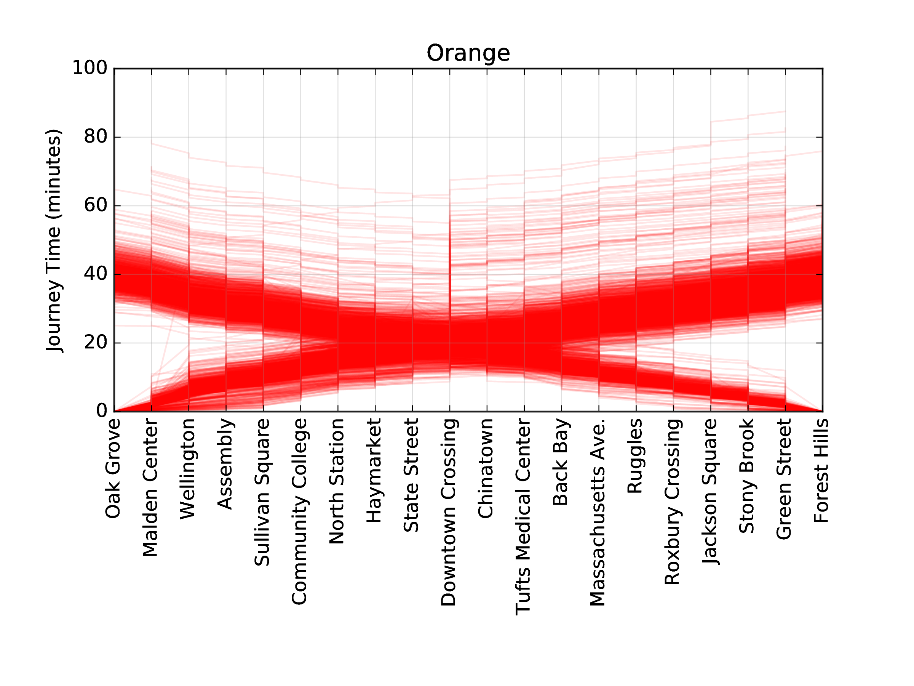

# mbta_performance

## Introduction

This project compiles MBTA subway performance data into convenient class for
further analysis. In the MBTA API, train data is provided in JSON format, with
travel times between stops and stop dwell times available individually. It also
does not contain tags for individual trains, making tracking of a single train
through the T-system difficult. This project attempts to simplify the data
collection from this API, and reduces the data into that of individual trains
for easy analysis. 

## Usage

The necessary modules are found in `mbta_performance`, and base MBTA subway line
data (in JSON data files) are in `data/lines`.  The base class to allow an MBTA
analysis is `mbta_performance.train.TrainCollection`. This class will allow the
user to download subway performance data, compiled into individual trains. These
trains can then be used for further analyses (e.g. MBTA delay announcement
responsiveness, delay magnitude prediction based on weather, etc.).

To start an analysis, simply `import mbta_performance`, and load a line:
```python
tc = mbta_performance.train.TrainCollection ()
tc.load_base_train (mbta_performance.train.lines.<line>)
```
The train direction can also be set by the `direction_id` tag ("0" or "1").
Using `datetime` objects, train performance data can be downloaded from the MBTA
API by:
```python
tc.set_data_path (<directory to download data to>)
tc.get_times (start_datetime, end_datetime)
```

Once this is done, the obtained files can be loaded for analysis:
```python
tc.load_times ()
```

Based on these files, `Train` objects are created, representing the path of a
single MBTA train through the line:
```python
tc.load_trains (num_trains=<desired train collection size>)
```
These trains are available at `tc.trains`. Each `Train` (e.g. `t =
tc.trains[0]`) is a collection of `TrainStop` objects (`t.stops`) and
`TrainTrack` objects (`t.tracks`), which hold information on the time the train
encountered that segment of its journey. All trains in the collection can be
iterated through by either `for t in tc` or `for t in tc.trains`.
`TrainCollection` objects further support slicing, where `tc[:100]` would return a
`TrainCollection` with only the first 100 `Train` objects.

Please note that because of missing information, a single `Train` may not have
information across the entire line. The interval over which the Train has data
(not necessarily complete) can be assessed through `t.start` and `t.end`,
which point to the starting point and ending point of the train data. This
interval can easily be traversed by iterating over the train, for example:
```python
for p in t:
    ...
```
This will access all `TrainStop` objects and `TrainTrack` objects between the
start and end, in line-order (alternating stops and tracks).

A specific segment of a given train can be easily accessed from the usual
`python` slice syntax. For example, `t[3:8]` would yield a train defined between
the 3rd and 7th stop in the train's route.

Perhaps the single most important metric for a single train is its end-to-end
travel time. This can be obtained through `t.total_travel_time`. This will
return a `tuple` containing the total travel time in seconds at index `0`, the
train's starting stop at index `1`, and the ending stop index at `2`.

To visualize the performance of an ensemble of trains, please see
`TrainCollection.plot_trains`. This method results figures like:



Finally, and "average" train for the ensemble is accessible with
`tc.median_train`. This train contains the median travel times and dwell times
in each leg of the train's journey through the line.
`tc.median_train.total_travel_time` can then give a baseline estimate of the
total travel time through the system for further analysis.

## Examples 

For example analysis scripts, please see `scripts/get_travel_dwell_times.py` (an
example to download T data) and `scripts/build_trains.py` (an example in
loading data and visualizing T travel times). A possible analysis of this T-data
might involve MBTA responsiveness in delay announcements. A corpora of these
announcements can be obtained for Twitter following the example of
`scripts/get_mbta_tweets.py`.

