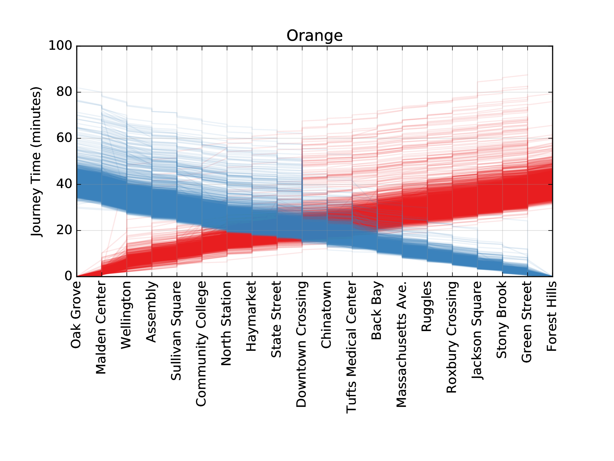

# mbta_performance

This project compiles MBTA subway performance data into convenient class for
further analysis. The necessary modules are found in `mbta_performance`, and
base MBTA subway line data (in JSON data files) are in `data/lines`.

The base class to allow an MBTA analysis is
`mbta_performance.train.TrainCollection`. This class will allow the user to
download subway performance data, compiled into individual trains. These
trains can then be used for further analyses (e.g. MBTA delay announcement
responsiveness, delay magnitude prediction based on weather, etc.).

To start an analysis, simply `import mbta_performance`, and load a line:
```python
tc = mbta_performance.train.TrainCollection ()
tc.load_base_train (<lines data directory location>, <line name>)
```
The train direction can also be set by the `direction_id` tag ("0" or "1").
Using `datetime` objects, train performance data can be obtained by:
```python
tc.get_traveltimes (<output directory>, start_datetime, end_datetime)
tc.get_dwelltimes (<output directory>, start_datetime, end_datetime)
```

Once this is done, the obtained files can be loaded for analysis:
```python
tc.load_travel_times (<list of travel time files>)
tc.load_dwell_times (<list of dwell time files>)
```
Based on these files, `Train` objects are created, representing the path of a
single MBTA train through the line:
```python
tc.load_trains (num_trains=<desired train collection size>)
```
These trains are available at `tc.trains`. Each `Train` (e.g. `t =
tc.trains[0]`) is a collection of `TrainStop`s (`t.stops`) and `TrainTrack`s
(`t.tracks`), which hold information on the time the train encountered that
segment of its journey. All trains in the collection can be iterated through by
either `for t in tc` or `for t in tc.trains`. `TrainCollection`s further support
slicing, where `tc[:100]` would return a `TrainCollection` with only the first
100 `Train`s stored.

Please note that because of missing information, a single `Train` may not have
information across the entire line. The interval over which the Train has data
(not necessarily complete) can be assessed through the `t.start` and `t.end`,
which point to the starting point and ending point of the train data. This
interval can easily be traversed by iterating over the train, for example:
```python
for p in t:
    print p
```
This will access all `Stop`s and `Track`s between the start and end in order.

A specific segment of a given train can be easily accessed from the usual
`python` slice syntax. For example, `t[3:8]` would yield a train defined between
the 3rd and 7th stop in the train's route.

Perhaps the single most important metric for a single train is its end-to-end
travel time. This can be obtained through `t.total_travel_time`. This will
return a `tuple` containing the total travel time at index `0`, the train's
starting stop index at index `1`, and the ending stop index at `2`.



The project contains code necessary to analyze MBTA T performance. To get T
data for a desired set of dates, see `scripts/get_travel_dwell_times.py`. A
corpora of MBTA tweets can be obtained using `scripts/get_mbta_tweets.py`.
Finally, to visualize T travel time performance for the data downloaded, see
`scripts/build_trains.py`.

